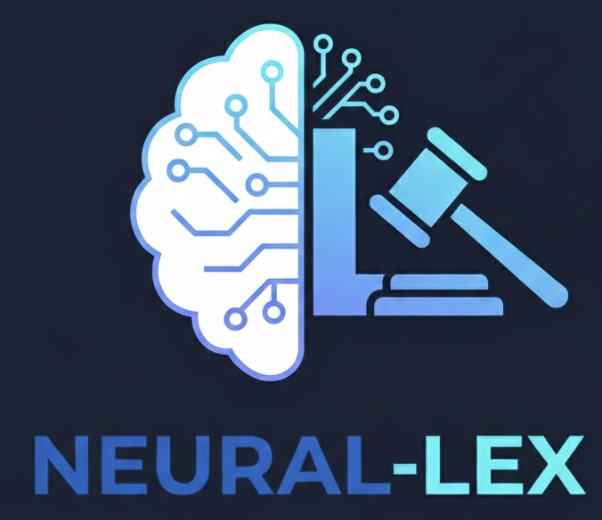

# neural-lex



`neural-lex` is a neuro-symbolic prototype for extracting legal rules from text and checking logical consistency with a SAT/SMT-style backend.

It is specifically tuned for Finnish traffic law (**Tieliikennelaki 729/2018**) using hierarchical decomposition and recursive querying inspired by [Recursive Language Models](https://medium.com/@pietrobolcato/recursive-language-models-infinite-context-that-works-174da45412ab).

## Key Features

- **Hierarchical Extraction**: Parses laws into sections and extracts normative logic atoms.
- **Recursive Reasoning**: Resolves cross-references (§) between sections recursively.
- **Symbolic Verification**: Detects pairwise conflicts and checks scenario satisfiability using Z3.
- **Agentic Extractor**: Optional LLM-based recursive extraction layer (OpenAI/Gemini).

## Quick Start

### 1. Installation

```bash
python -m venv .venv
source .venv/bin/activate
pip install -e ".[dev,solver,llm]"
```

### 2. Run Consistency Check

```bash
# Run on an example excerpt
python -m neural_lex.cli --text-file examples/tll_ch2_excerpt.txt --chapter 2
```

### 3. Use Recursive LLM Extractor

```bash
python -m neural_lex.cli --text-file examples/tll_ch2_excerpt.txt --use-llm --gemini --google-key YOUR_KEY
```

## Documentation

- [AGENTS.md](AGENTS.md): The "Context-as-State" recursive architecture.
- [TECHNICAL.md](TECHNICAL.md): Logic atom schemas, reasoning internals, and CLI reference.
- [neural_lex/README.md](neural_lex/README.md): Core module implementation details.

## Testing

```bash
pytest
```

---
> [!NOTE]
> This is a technical prototype and not legal advice.
